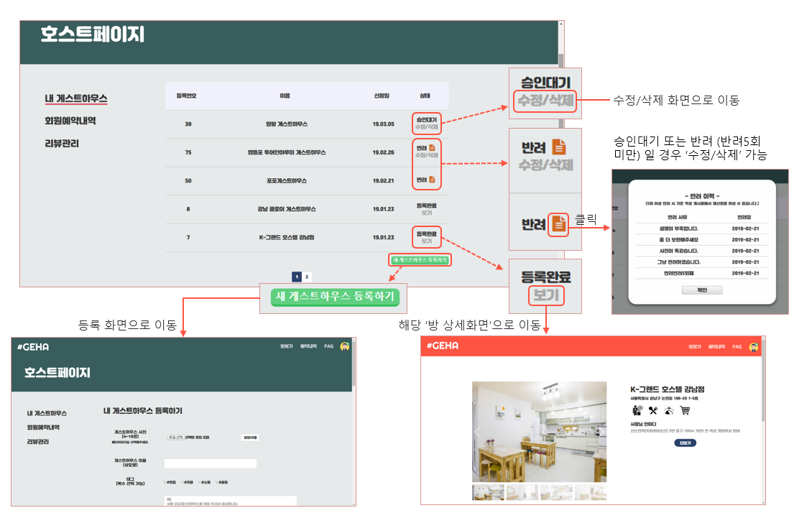
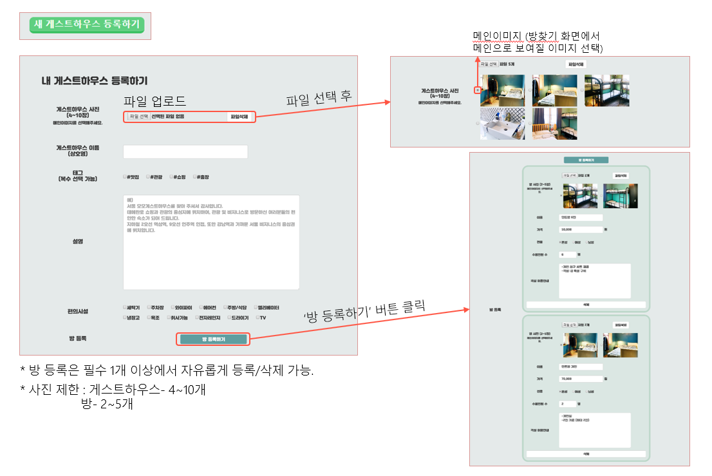
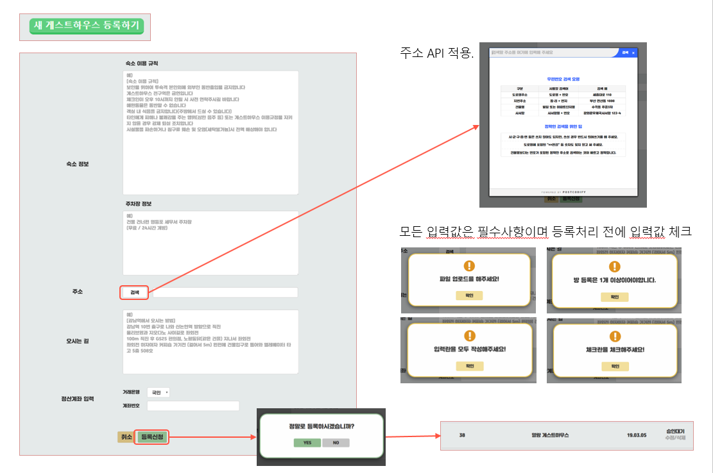
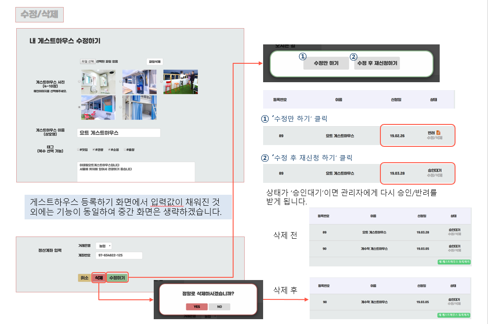
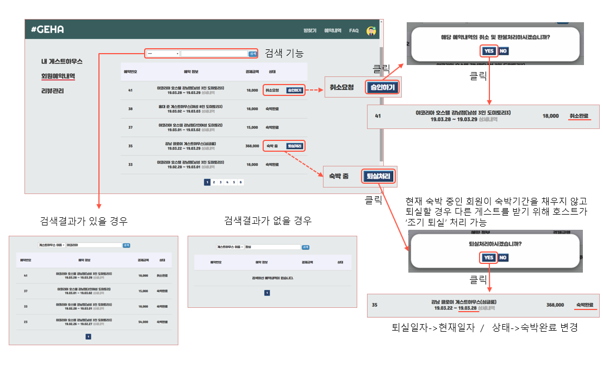
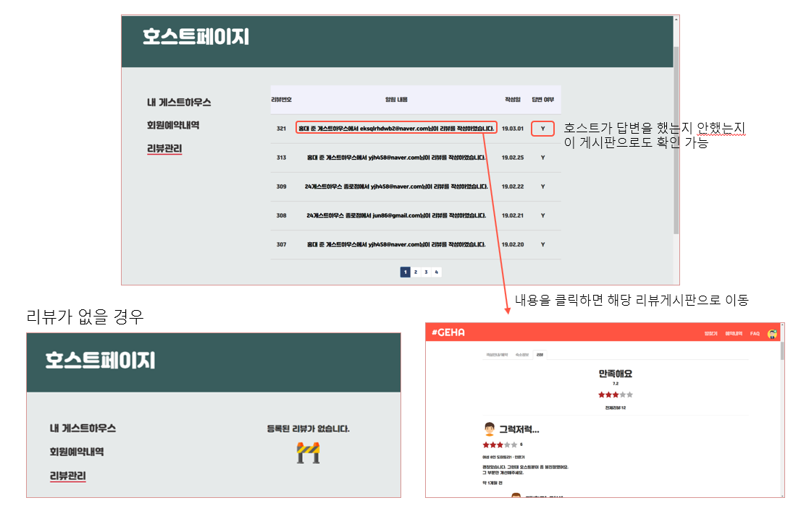

## 주제
목적에 맞는 게스트하우스를 찾을 수 있도록 제공해주는 웹 서비스.

## 기술 스택
|Back-End|Front-End|Tools&ETC|
|:---:|:---:|:---:|
|java8|HTML|Intellij|
|Spring Boot|Thymeleaf|GitHub|
|MyBatis|AJAX|AWS|
|Junit|JavaScript||
|MariaDB|CSS||

## DB 설계

## 구현 기능 소개

예약하기

마이페이지 > 예약내역(예약목록, 후기작성)

호스트페이지 > 내 게스트하우스(목록, 작성, 수정, 삭제)

<h4>목록</h4>

<h4>작성</h4>

<h4>수정</h4>

호스트페이지 > 회원예약내역

호스트페이지 > 리뷰관리

